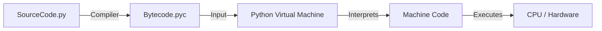

1. Bảng so sánh: Trình biên dịch (Compiler) vs. Trình thông dịch (Interpreter)

| **Tiêu chí**  | **Trình biên dịch (C++, Go, Rust)**                                                               | **Trình thông dịch (Python, PHP, JS)**                                                          |
| ------------- | ------------------------------------------------------------------------------------------------- | ----------------------------------------------------------------------------------------------- |
| **Cơ chế**    | Dịch **toàn bộ** mã nguồn (Source Code) ra mã máy (Machine Code) một lần duy nhất trước khi chạy. | Dịch từng lệnh (hoặc khối lệnh), chuyển thành mã máy và **thực thi ngay lập tức** theo tuần tự. |
| **Đầu ra**    | Tạo ra một file thực thi độc lập (`.exe` trên Windows hoặc binary trên Linux).                    | Không tạo file thực thi độc lập. Cần có môi trường (Python runtime) để chạy file nguồn `.py`.   |
| **Thời gian** | Tốn thời gian chờ biên dịch (Compile time) lâu, nhưng chạy (Run time) cực nhanh.                  | Không tốn thời gian biên dịch (chạy ngay), nhưng tốc độ thực thi chậm hơn.                      |
| **Báo lỗi**   | Quét toàn bộ code, báo tất cả lỗi cú pháp **trước khi** chạy chương trình.                        | Chạy đến dòng nào lỗi thì báo ở dòng đó. (Dòng 1 đúng vẫn chạy, đến dòng 2 lỗi mới dừng).       |
| **Bảo mật**   | Mã nguồn được giấu kín (người dùng chỉ nhận được file `.exe`).                                    | Mã nguồn công khai (thường phải giao file `.py` cho người dùng hoặc server).                    |
2. Mô hình hoạt động của Python (Thực tế nó là lai (Hybrid)!)

